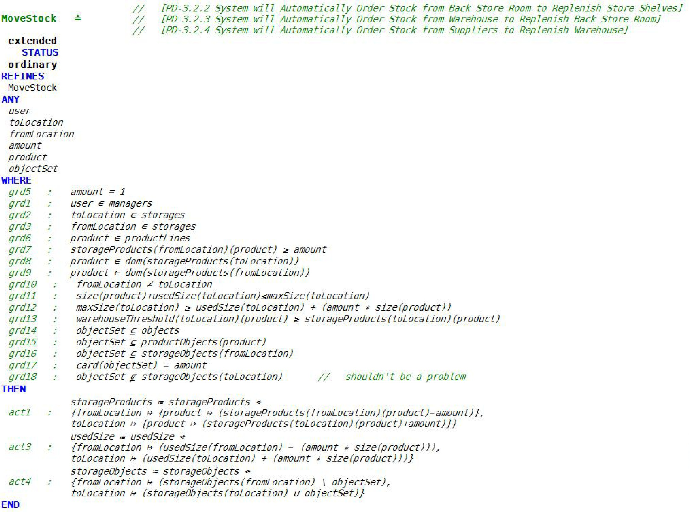
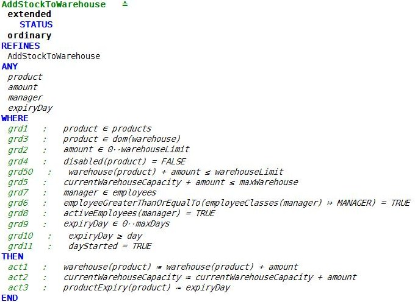
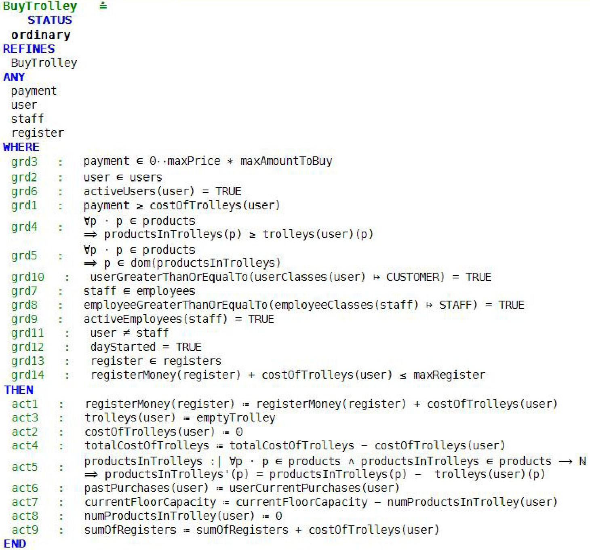
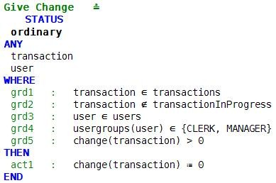
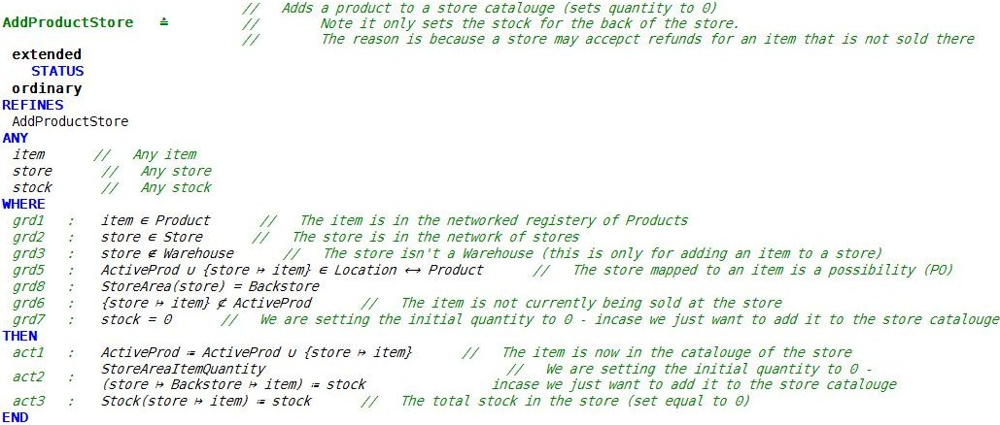

latex input:		mmd-article-header
Title:			Specification Critique
Author:			Group 03
Email:			se2020.grp03@cse.unsw.edu.au
Date:			05 August 2012
Base Header Level:	2
LaTeX Mode:		article
latex input:		mmd-article-begin-doc
latex footer:		mmd-memoir-footer

<!-- \pagebreak -->
<!-- \tableofcontents -->
<!-- \pagebreak -->
#Specification Critique

##Introduction
###Invariants & Theorems
Invariants should express all constraints on the machine that are important to the integrity of the system. They are not merely used as a method to declare variable types. The invariants should be used to specify the semantic relationships between variables. It is also said that invariants should be as strong as necessary but no stronger. Theorems provide a way for checks to confirm those properties that are *"obviously"* true. Good invariants confirm that the model is working as it should, enforces the guards and actions, and ensures that there are no loopholes in the system.

###Concrete
The models should describe behaviour, not details of how that behaviour is obtained. Therefore, models should be abstract, rather than concrete. Concrete models are too detailed, thus hard to implement and the it is not portable.

###Machine Sequence
The way the refinements are carried out in the model should be in a way that the previous machine has a link to the next. The refinements should carry over properties is related to the previous machine. Machine Sequence affects the flow of implementation and deployment sequence.

###Clarity
The model should be readable by humans. A model that looks complicated and impressive might not be a good model. Don't confuse complexity with quality. Readability of naming convention is also very important. Clarity will allow for easy implememtation.

##Invariants & Theorems

###Invariant used to reinforce semantic relationships

###Group 4
Semantic relationship are reasonably obvious in group 4's model- there were strong constraints in some machines that show linkage between each variables. These constraints were primarily relationship between size and numbers, and were particularly stronger in areas such as inventory and warehouse stock management. Such example would include usedSize and maxSize from the storage area machine.
<!-- \\ \\ -->However in machines where integrity constraints were lacklustre, it can be seen that this is due to the model’s several ‘small refinements’, where only one to four variables were only introduced. This became apparent with the newer variables having no linkage with the former variables, such as warehouseThreshold and a storage’s usedSize. Furthermore, basic number values and size comparisons were neglected, for example the relationship between the currentDay, a product’s timeToExpire and its expiryDate, despite including many of these in the earlier refinements. These relationships were only reinforced in the guards in the relating events.
<!-- \\ \\ -->In one respect, the lack of constraints can be seen as acceptable, owing to the fact that this specification attempts to model real world restrictions through its idea of having general attributes, and essentially having one variable representing the many viable ‘loss’ constraints. 

###Group 7
Group 7’s invariants and their properties are similar to group 4’s, in that some constraints were included and appropriate at times, and lacking in the later refinements- many of the later invariants were type based constraints. It was also noted that this group’s specification had the most number of refinements out of the four.
<!-- \\ \\ -->Similar to group 4, each of these refinements, especially the latter ones introduced one to three variables. There was also a distinct lack of important associations between older and newer variables, for example, the stock threshold in each floor and the floor’s capacity as well as orders and their amount not exceeding the capacity. This can be largely due to high numbers of refinements, where the separated related variable become easily lost between each refinement.
<!-- \\ \\ -->The constraints were largely relevant to warehouse stock, and floor locations, similar to group 4’s, where it establishes separate compartments and entities a product has to exist in. For example, the linkage between products, stock, floor, backroom and warehouse in the location machine. Compartmentalisation is also seen with registers, in particular moneybox, storeSafe and sumOfRegisters, in the later refinements. 

###Group 11
Group 11 had both appropriate and unnecessary invariants. Given its high number of undischarged POs, it can be seen that many of these unnecessary invariants backfired and rooted logical and correctness issues. Similar both group 4 and 7, many of these integrity constraints were not sustained throughout the refinements, with lesser in the loyalty, discounts and schedule machines. 
<!-- \\ \\ -->Integrity constraints were stronger in areas such as transactions, where linkage was very clear between how the instore cashtill operates with its topay and transactionInProgress variables, accompanied by comments that describes this relation. The specification also at times associates variables from its previous refinements, such as products in the shoppingcart with the number of stocks available to purchase.
<!-- \\ \\ -->There were no invariants in the Users machine where authorisation and privileges were enforced. Many of these relationships depended on its event based guards, with no invariant that ties together what a higher level access level can general ‘modify’. The lack of constraints in the more complicated concepts such as the spec’s scheduling system created unclear and ambiguous functionalities in the spec. For example, whether if a schedule can be both a specialSchedule and orderSchedule at the same time and function concurrently. Moreover, this ambiguity in the model underscores flaws in the original requirements and design, rather than just the specification/Event b model itself.

###Group 3
Based on the above three specifications, we (group 3) derived a number comparable improvements to be made. The main issue with our specification concerns the lack of constraints that describes the semantic relationship between variables, and this can be seen through the number of proof obligations our model had in total. Through identifying and understanding other models, we were able to highlight how weak constraints impact the cohesion as a system, and the corrective value of the model.
<!-- \\ \\ -->It was also observed that while the above three specs operates with multiple functioning trolleys of products by different users simultaneously, our model handles one transaction at a time, given one moneybox and trolley, and this can somewhat infer a distinct relationship with the number of complex constraints our spec had to consider.
<!-- \\ \\ -->Despite having no integrity based constraints, some of our guards were sufficiently comprehensive, and thus can be translated and generalised to become more appropriate invariants. For example, the interaction between the purchases of ReservedStock, ReservedNum, stock and trolley with ActiveProd can be readily prepared and translated to an invariant based on the BuyReserve and ReserveProduct events. With these guards, our team can consider outlining possible and more effective invariants to add and improve in the later stages.

###Use of theorems
In all four groups, no theorems were included, and will be disregarded for this basis of this critique.

##Concrete

###Group 4

This group demonstrated good abstract design for most of their requirements. As we can see, the product requirements only describe the behaviour of the system instead of depicting specific stuff on how the requirement will be accomplish. Looking at PD-2.2.1 and PD-2.2.2 (appendix A, figure 1), the two product requirements have goo abstract design because they just model the behaviour of the system without providing any specific ways or information that suggests how the system would meet the goal. However in event-B, their way of constructing the user access is too concrete because they have to specify which user was granted the access in each function. Also some of the events contain too many details.  For example in the MoveStock event (appendix A,figure2), this event contains too many guards that would make this event too specific. The group should distribute the guards out of the machine would be more abstract.  

###Group 7

Overall, this group have most of the requirements well model, but a few requirements are too specific and can be broken down further.  For instances, PD-2.5.5 (appendix B,figure1) is too specific because I know how the goal would be accomplish. They should move those requirements down or make them more abstract. For example, PD-2.5.3(appendix B,figure1) should be replaced as the system can handle item storage so then in the design level can then state that the same items would be place at the same location. As for the Event-B, they have too many guards in each function that would make their model too specific. For instance in the event AddStockToWarehouse (appendix B,figure2), the function has a lot of guards while there are only two actions.  Some of those guards can actually be moved to the invariants at each machine instead of within each function. Then in the BuyTrolly event (appendix B,figure3), the function contains too many details which would make the model too concrete. Like in a scenario when the registrar ran out of money, the guard would actually restrict the staff from making the transaction because the guard states it so therefore the event can not be fired. Maybe the cashier would actually want to settle the transaction first then proceed to get the changes for the customer. An abstract event would need to be as general as possible to compute with as many situations as possible. 

###Group 11

This group has the most concrete requirements among the four groups. Referring to PD-1.2.6 (appendix C,figure1), the requirement is too concrete because I can figure out how the goods will be dealt with when it is in a replacement order. The requirement should be more abstract like the system can handle replacement orders or else you can’t extend that product requirement further down to design level. Then the event-B for this group has a lot of specific events that probably would only suit for some limited situation. By taking a look at this simple event Give Change (appendix C,figure2), this event has too many guards for only one operation. More guards should be delegated at the top of the machine and the invariants could be more general to make the model more abstract. 

###Group 3

This group has most of the requirements model fairly abstract with a few requirements that could be better. For example PL-2.4.3 (appendix D,figure1) contains specific information that list out the attribute that the system would store. The requirement can be replace as the system can record product details and then extends that requirement down to design level where it can then state the previous attributes that were mentioned.  Most of the events in Event-B were modelled well except for some events like AddProductStore (appendix D,figure2), the event contains too many guards that would make the function too specific. The function could be better to rearrange the guards out of the functions and also reduce the amount of information in the event. 

###Conclusion
Overall, most of the groups have their requirements well modelled, but the Event-B was too specific in general. Out of all the groups, group 4 have the most abstract model for both the requirement and Event-B. Our group (group 3) is place in the middle because most of our requirements are well modelled. Group 11 have most concrete model and contains too many details in some of the functions making it cause too many errors in the model.

##Machine Sequence

###Group 04

####Machine Sequence

* StorageArea
<!-- \itemsep0em -->
* WarehouseR0
* WarehouseR1
* InventoryR3
* StoreR4
* StoreR5
* StoreR6
* AdministrationR7
* WarehouseR8
* StoreR9
* CustomerR10
* ExpiryR11
* ExpiryR12
* SplittersR13
* ExpiryR14

####Critique
Group 04 has the most number of machines among the 4 groups that we have decided to critique on. Coming in at a total of 15 machines. They started their model well. As the machines have strong relationships/linkage between each other as the refinement progresses. But started showing problems in their from AdministrationR7 onwards. Having not planned well before hand, they had to refine AdministrationR7 into WarehouseR8 to add in *event SetThreshold* and *event MoveStock refines AddObject*. They could have easily done that in StoreR6. <!-- \\ \\ --> Following on, they modelled StoreR9 to be able to choose, purchase, refund and move products. CustomerR10 to model loyalty points and memberships. Next, they followed on by modelling ExpiryR11, ExpiryR12. These refinements could have been incorporated into previous machines and clearly do not have any relations to the previous machine CustomerR10. <!-- \\ \\ --> They tried to split the stores/warehouse into different areas with the next refinement being SplittersR13. And with the new areas, they had to set the expiry to move stock to the new designated areas resulting in the refinement ExpiryR14. Due to lack of foresight and planning, the group did not have a good machine sequence. <!-- \\ \\ --> Instead of continuing to refine the machines in this way, they could have saved themselves much trouble by actually editing the previous machines to reflect the changes in work flow instead of pressing on.

###Group 07

####Machine Sequence

* POS-Product-R0
<!-- \itemsep0em -->
* POS-Stock-R1 
* POS-Location-R2 
* POS-Trolley-R3 
* POS-User-R4 
* POS-Return-R5 
* POS-StorageCapacity-R6 
* POS-UserClasses-R7 
* POS-Days-R8 
* POS-Threshold-R9 
* POS-Registers-R10 
* POS-ProductType-R11 
* POS-Discount-R12 
* POS-PaymentMethods-R13

####Critique

Group 07 has quite a number of machines, 14 machines. Although unlike Group 04, overall, they have a better thought out model in terms of machine sequence. Most of the refinements are clearly related with each refinement building on to the previous machine. Improvements could still be made though. <!-- \\ \\ --> If they had added in the different user capabilities from POS-UserClasses-R7 into POS-User-R4, they could have brought POS-Threshold-R9 and POS-ProductType-R11 up into the earlier refinements after POS-StorageCapacity-R6 and the later refinements would only be dealing with *Registers, Discounts and Payment Methods* which would have a better flow. In this case, even when dealing with a large number of machines, Group 07 has done well in terms of machine sequencing.

###Group 11

####Machine Sequence

* BasicPOS
<!-- \itemsep0em -->
* Orders 
* Locations 
* Users 
* Transactions 
* Loyalty Program 
* Price Modification and Refund 
* Schedule

####Critique

Group 11 has less machines compared to the previous 2 groups. The flow is similar to group 07, with the basic warehousing system modelled first, followed by ordering of stock from suppliers. And then on to the Locations which should come before Orders, as it makes for a better machine sequence. The next refinement, Users and then to Transactions followed by the Loyalty Program. Price Modification and Refund machine should come before the Loyalty Program as it has more to deal with Transactions. Schedule should come after Orders or Locations as it deals with the scheduling of stock and not refined from Price Modification and Refund

###Group 03

####Machine Sequence

* PoSWare
<!-- \itemsep0em -->
* WarehouseR1 
* StoresR2 
* RetailR3 
* MembershipR4

####Critique

Our group also has less machines compared to group 04 and group 07. Comparatively, our group has good machine sequencing. With modelling the behaviour of the overall system in PoSWare and refining it into Warehouses and Stores. Following that, it was further refined to Retail to deal with transactions and refunds. And the finally refined into Membership to deal with various membership benefits.

##Clarity
###Naming the project

The name of project should  clarify briefly at the first look.In SENG projects, It's a good practise to mention the Group number and the module's name. None of the group have done it properly, Group 07 chose the name “SENG”, Group 04 chose “PosWare” and Group 11 called it “POS”. None of these gives any information about which group are these which  just make it hard for marker to figure group's number by himself. However group 3 just called Group3, which is the best in here but not enough. (no mentioning the modules name)

###Good use of naming variables

####Group 4

At early stage of refinement group 4 have clear and distinguished names for variables and parameters, but at the end many names are almost repeated for different varable without extra explanation such as : “basket objects” and “basket product”. 

####Group7 

Chose resemble naming for their variable but they haven't keep the correct style of naming system, such as instead of “floorShelves” they used “floorshelves” which in a long list will makes hard to distinguished. 

####Group11 

Group 11, made the same mistake as Group 7. such as “pointsaccumulated” , These mistakes  makes it hard to read, which is one of the main purposes of modelling. 

####Group3 

Same mistake but not as much as other groups . As an example “Reorderlevel” Good naming of refinement and correct positions for refinement, for easy finding. In General a weak point of Event-B is it will order the machines based on alphabetic order, while it might show nothing and just caused the misunderstand. But having said that it can be handled. So reader can understand which machine is the refinement of which one.
###Naming of Machines
####Group 4
Group 4 did a trick by adding R[number] at the end of each machine and context . It number indicate the number of the refinement. However, they haven't done it properly by forgetting to use this system for all machines , such as example “storage area” has no R at the end. Beside the ordering is still confusing . They could use the numbering at the beginning.

####Group 7 
Group 7 did the same technique but correctly , however they are also having the same ordering issue , including the extra “POS_” at the beginning which again make it harder to read trough the list.  Such as “POS_Discount_R12”,”POS_Days_R8” and “POS_Return_R5”. It's a psychological reason that eye first look at the start of line which here it's just lead to confusion.

####Group 11
This group haven't done anything to solve this problem and it will make the reader just to look each machine and flow the path backward to reach the beginning. And again search for the refinement. So immature.

####Group 3
This group haven't done anything extra than groups 4 and 7.

Conclusion: In order to make it easier to read the machines in project and find out the refinement of a machine, machines should be called 1.[machine_name], based on their ordering system, so Event-B order it automatically and also the user knows which machine is the next refinement. 

###Adding new events properly

In Event-B when new events are added to the refinement they should be added to the top of the list, not at the button. This simple mistake will make the user just scroll down in each refinement to reach the new events.As an example the in group4 for machine ExpiryR12 to reach the new events user needs to pass 14 old events.The only group who did this properly is the group 3. <!-- \\ \\ --> To sum it up, some easy practice which can make the module easier to read have been forgotten by many groups. Such as mentioning the group number and the module name on project name. Clear and distinguished naming for variable events and parameters with using the correct naming style. Ordering the refinement in-order to make it easy to find the next refinement. And the last adding new events to the top of old event in order to prevent scrolling all the way down.

#"New" Specification Summary

##Things to be changed

* Data to be tracked in central database (as opposed to one for stock, another one for membership and another one for staff data)
* Expiry dates are to be tracked and expired products are to be subtracted from the total stock number.
* Strategic placement of items to ensure optimized shopping experience.
* Rewards scheme changed (from 1 point = 1 dollar off)
* Refund process changed. Allows the buyer to have the option of store credit (applies to members only)

##Summary

All of these changes and additions were made after critiquing the groups and seeing which areas we lacked in (refunds, rewards scheme for members). The change to a singular database comes as the complexity involved with the interactions required between 3 databases may lead to a higher chance of concurrency issues and will be difficult to spot and fix. Our item tracking system was lacking and thus expiry dates are now being kept track of as well as the ability to strategically place items in places where more sales are more likely to occur as well as make it easier for shoppers to find similar items.
<!-- \\ \\ -->With all things considered, there could have been a lot more additions all containing good features but we feel we should implement concepts that are familiar to us first, then add on the small amount of changes as listed above.

#Project Plan

##Tasks to be done:

###1. Determine Framework/Languages

Person(s) Responsible: Whole group
<!-- \\ -->Timeframe: 1 Week (Week 4-5)
<!-- \\ -->Task Prerequisites: None
<!-- \\ \\ -->Our first step will be to determine what frame work and languages we will use in the development of this project. As we have 5 members, our familiarity with different frameworks and languages is very diverse. Java/C++ was a popular choice amongst the group as most of us had experience in dealing with it. However, a strong contender is Scala as the functional programming aspect is appealing and the similarities between itself and Java mean that it will not be too unfamiliar to us.
<!-- \\ \\ -->This is a vital task that needs to be completed as soon as possible (within 1 week) because the design will be able to follow on from there with thoughts about the implementation being in mind.

###2. Choose required functionality from specification

Person(s) Responsible: Whole group
<!-- \\ -->Timeframe: 1 Week (Week 4-5)
<!-- \\ -->Task Prerequisites: None
<!-- \\ \\ -->As much as we would want to, there is not enough time to implement all the features of the system so there will need to be cutbacks on what is going to be implemented. While we are cutting back on what we choose to implement, we must also make sure that its core functionality is not affected as it is more important to have a working prototype rather than one that does not work and contains niche features.
<!-- \\ \\ -->This task should not go longer than 1 week as the presentation showing the design is occurring not long after. Although this task is not a deliverable, it is still crucial as once we map out what we are and aren't doing it will reduce the amount of overhead present with our overall design since there will be no need to account for those features.
<!-- \\ \\ -->The task will be completed by the whole group as everyone should give input and feedback on what should stay and what should go.

###3. Class Diagram

Person(s) Responsible: Jeffrey, Stanley
<!-- \\ -->Timeframe: 1 Week (Week 4-5)
<!-- \\ -->Task Prerequisites: None
<!-- \\ \\ -->The class diagram is an overview of the system we will be implementing outlining the communication between modules as well as its relationship. The diagram is to be shown to our mentor who will give feedback on appropriateness as well as point out any issues that we may have overlooked.
<!-- \\ \\ -->Group members Jeffrey and Stanley will be responsible for completion of the task as they know the groups system well and also have done class diagrams before which is a bonus.

###4. Develop design of implementation (Design Presentation)

Person(s) Responsible: Mike, Daniel, Armin
<!-- \\ -->Timeframe: 2 weeks (Week 5-7)
<!-- \\ -->Task Prerequisites: Choose required functionality from specification
<!-- \\ \\ -->The design plan consists of a model consisting of our design of the implementation. The design will come from our Event-B model and elements of the design should be able to be traced back to the Event-B model. Components required to achieve our solutions are to be outlined and their relationships with each other will also be shown. The core functionality should be able to be seen throughout as well as any additional extension features. A brief sample of a user interface will be included and the reasoning for the choice of design.
<!-- \\ \\ -->While the main responsibility for the design will be allocated to Mike, Daniel and Armin, ideas and critiquing will be carried out by the whole team to ensure that the design is what we want.

###4. Begin implementation of prototype

Person(s) Responsible: Whole Group
<!-- \\ -->Timeframe: 4 weeks (Week 7-11)
<!-- \\ -->Task Prerequisites: Develop design of implementation
<!-- \\ \\ -->With the plan done, implementation must begin. With the plan set, it should be quite clear of the sequence that all the modules shall be implemented. Front-end and back-end tasks will be delegated to people who are more confident in each discipline. Since we will most likely use Scala, a language whom we have not much experience in dealing, the front-end developers will be those who have a design flair and those who like to deal with data. 

###5. Begin working on Final Report

Person(s) Responsible: Whole Group
<!-- \\ -->Timeframe: 4 weeks (Week 8-12)
<!-- \\ -->Task Prerequisites: Develop design of implementation
<!-- \\ \\ -->The Final report shall be started once the implementation design is done. It is done concurrently with the implementation so that our understanding of specific parts of the system do not wane over time, and specific problems can be pointed out with ease. 
<!-- \\ \\ -->The report will be split up in sections to be completed by our two teams (front-end/back-end) 

<!-- \pagebreak -->
#Appendix
##A
###Figure1
PD-2.2.1 (!M) System will Keep Track of all Transactions.
All transactions made by the system will be stored in the system.
PD-2.2.2 (!M) System will Keep Track of Related Transactions.
Any related transactions are flagged in the system.

###Figure2

<!-- \pagebreak -->
<!-- \pagebreak -->
##B

###Figure1
PD-2.5.3 Items are placed under the same classification and this will define which shelf it is
placed on
PD-2.5.5 The placement of a product on a specific shelf is defined by the size of the store,
it’s location and season

###Figure2

<!-- \pagebreak -->

###Figure3

<!-- \pagebreak -->

##C

###Figure1
PD-1.2.6 Goods that have been replaced by a replacement order are automatically placed into a special/spot sale specification.
Replaced goods that are approaching use-by date will be placed into a discount class for spot sales and specials.

##Figure2

<!-- \pagebreak -->

##D

###Figure1
PL-2.4.3 The system will record details about specific items (price, desc, weight, size, barcode)

###Figure2

